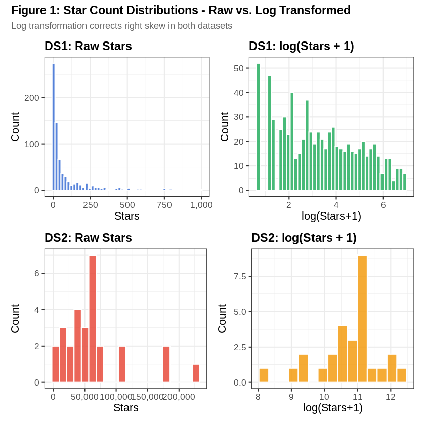
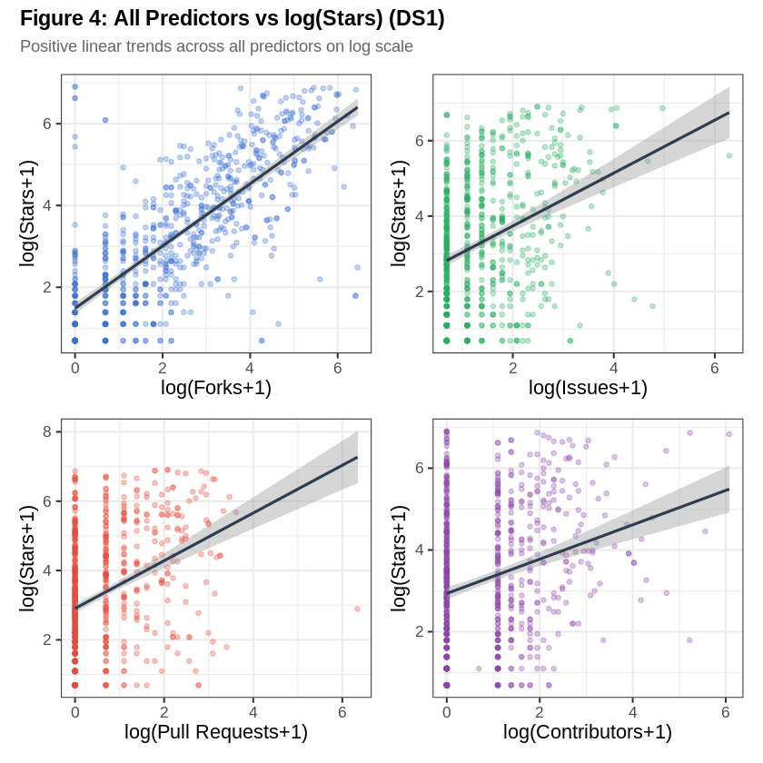
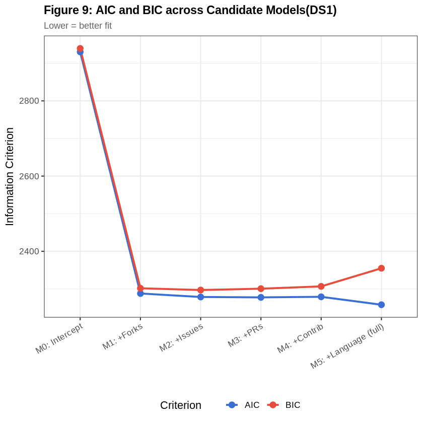
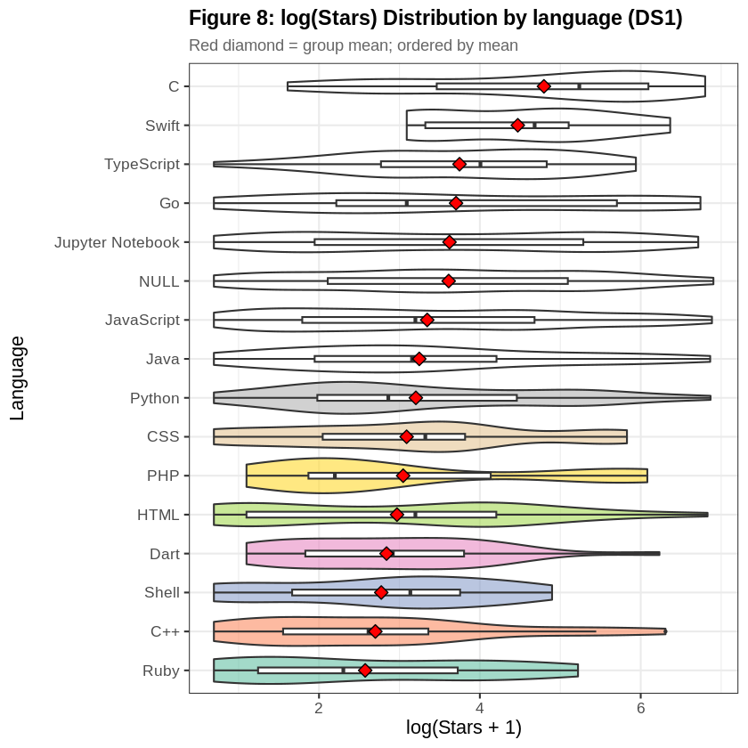
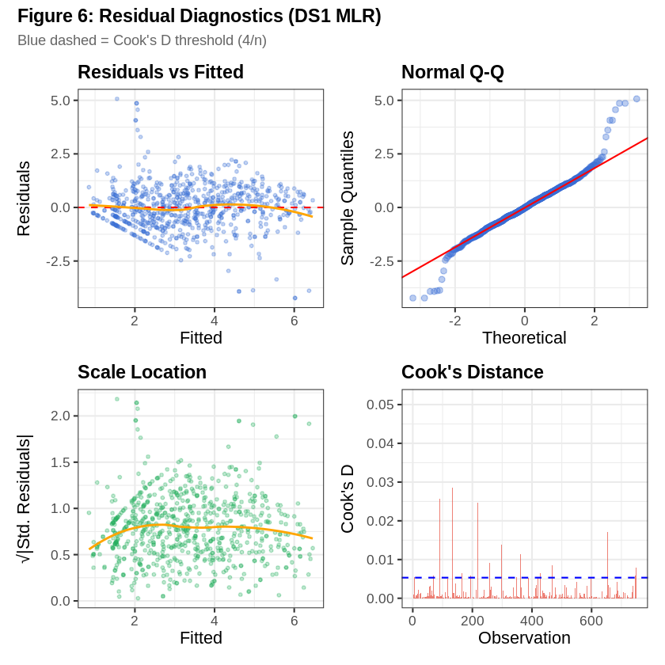
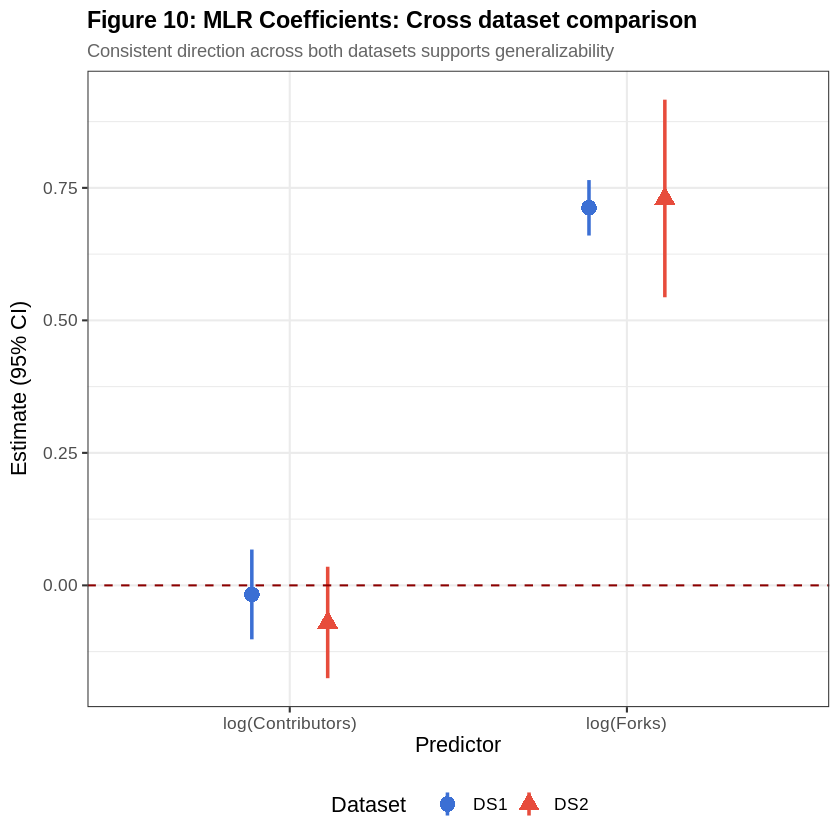

# GitHub Repository Popularity — Multi-Dataset Statistical Analysis

[](https://r-project.org)
[](#methods)
[](https://github.com/Aayushx9/GitHub-Repository-Popularity-Statistical-Analysis/blob/main/LICENSE)

**Author:** Aayush Bharadwaj · [github.com/Aayushx9](https://github.com/Aayushx9)
**MS Data Science · University of Colorado Boulder · STAT 5010, Spring 2026**

> What repository-level features — forks, issues, pull requests, contributors, and issue-resolution behavior — predict GitHub star count? Tested across two independently structured datasets (1,052 and 28 repos) using MLR, Poisson/Negative Binomial GLMs, ANOVA, Kruskal-Wallis, and AIC/BIC model selection, with full cross-dataset validation.

[📄 Full paper](Paper.pdf) · [📓 Analysis notebook](<GitHub Repository Popularity - Multi-Dataset Statistical Analysis.ipynb>)

---

## Research Question

What repository-level features are statistically significant predictors of GitHub star count, and do these relationships generalize across two independently structured datasets?

## Datasets

| File | Rows | Cols | Role |
| ---- | ---- | ---- | ---- |
| `github_dataset.csv` | 1,052 | 7 | DS1 — primary modeling (broad repo sample with language labels) |
| `repo_data.csv` | 28 | 20 | DS2 base — curated OSS repos with derived metrics |
| `issues_data.csv` | 7,082 | 11 | DS2 supplement — issue-level records aggregated onto DS2 |

DS1 drives the primary modeling (MLR, GLMs, ANOVA, nonparametric tests, model selection). DS2 — enriched with per-repo issue-resolution metrics aggregated from `issues_data.csv` — provides independent, out-of-sample validation.

---

## Methods

| Method | Applied To | Purpose |
| ------ | ---------- | ------- |
| Multiple Linear Regression (MLR) | DS1 + DS2 | Baseline model on log(stars) |
| Poisson GLM | DS1 | Count model baseline |
| Negative Binomial GLM | DS1 + DS2 | Count model accounting for overdispersion |
| One-Way ANOVA | DS1 (by language) | Test equality of mean log(stars) across languages |
| Kruskal-Wallis + Dunn | DS1 (by language) | Nonparametric robustness check |
| AIC/BIC + Stepwise | DS1 | Model selection across candidate models |
| Residual Diagnostics | DS1 MLR + NB | Full assumption validation |
| Cross-Dataset Comparison | DS1 vs DS2 | Generalizability assessment |

---

## Key Findings

### 1. Star counts are severely right-skewed and overdispersed

[](assets/Figure1_StarCount_Distributions.png)

DS1 raw stars: mean 102.1, median 23, max 995 — classic long-tailed engagement data. Log transformation restores approximate symmetry in both datasets.

### 2. Forks and contributors are the strongest predictors

[](assets/Figure4_Predictors_vs_LogStars.png)

The full MLR model (`log(stars+1) ~ log(forks+1) + log(issues+1) + log(prs+1) + log(contributors+1) + language`) on DS1 (n=751, after cleaning) achieves **R² = 0.6116** (adj. R² = 0.6015). `log(forks+1)` is by far the strongest predictor (β = 0.712, p < 2e-16); issues and pull requests are also significant (p = 0.0028 and p = 0.030); contributor count alone is not significant once the others are controlled for (p = 0.693).

### 3. Negative Binomial decisively beats Poisson

[](assets/Figure9_AIC_BIC_Comparison.png)

The Poisson GLM's dispersion ratio is **97.15** — massive overdispersion that invalidates Poisson inference. The Negative Binomial GLM drops AIC from **74,850.86 to 7,487.05**, confirmed by a likelihood-ratio test (χ² = 67,365.8, p < 0.001).

### 4. Programming language significantly affects popularity

[](assets/Figure8_Stars_by_Language_Violin.png)

One-way ANOVA: F(15, 735) = 2.58, p = 0.000887. Confirmed nonparametrically via Kruskal-Wallis (χ²(15) = 35.76, p = 0.0019). Tukey HSD identifies 6 significant pairwise differences, all with **C** repositories scoring higher (e.g., Ruby − C: Δ = −2.22, p-adj = 0.012) — likely driven by landmark system-level C projects like the Linux kernel.

### 5. Residual diagnostics support the model

[](assets/Figure6_Residual_Diagnostics.png)

Residuals vs. Fitted shows no systemic curvature; Scale-Location is approximately flat; Q-Q shows only mild tail deviation (expected for count-derived data); all VIFs < 5 (no severe multicollinearity); Cook's Distance flags a small number of influential but legitimate high-star outliers.

### 6. Findings generalize to an independent dataset

[](assets/Figure10_CrossDataset_Coefficients.png)

Refitting on DS2 (n=28, independently curated, enriched with aggregated issue-resolution metrics) yields **R² = 0.7582**, with `log(forks+1)` retaining a positive, significant effect (p < 0.05) and `log(contributors+1)` retaining the same direction as DS1. DS2 also reveals that faster issue-resolution time and higher issue-closure rate correlate with more stars ([Figure 5](assets/Figure5_IssueHealth_vs_Popularity.png)).

---

## Model Comparison

| Model | AIC | BIC | R² | Adj. R² |
| ----- | --- | --- | -- | ------- |
| M0: Intercept | 2930.18 | 2939.42 | 0.000 | 0.000 |
| M1: +Forks | 2287.81 | 2301.67 | 0.576 | 0.575 |
| M2: +Issues | 2278.51 | 2296.99 | 0.582 | 0.581 |
| M3: +PRs | 2277.47 | 2300.58 | 0.584 | 0.582 |
| M4: +Contributors | 2278.97 | 2306.69 | 0.584 | 0.582 |
| **M5: +Language (full)** | **2257.88** | 2354.93 | **0.612** | **0.602** |

Bidirectional stepwise selection (AIC) retains the full model minus contributors: `log_stars ~ log_forks + log_issues + log_prs + language`.

---

## Quick Start

```
git clone https://github.com/Aayushx9/GitHub-Repository-Popularity-Statistical-Analysis.git
cd GitHub-Repository-Popularity-Statistical-Analysis
Rscript requirements.R
jupyter notebook "GitHub Repository Popularity - Multi-Dataset Statistical Analysis.ipynb"   # R kernel
```

Or read [Paper.pdf](Paper.pdf) for the full formal write-up (abstract, methods, assumptions, references).

---

## Tech Stack

| Category | Tools |
| -------- | ----- |
| Language | R 4.5.3 |
| Modeling | MASS (NB GLM), car (VIF), stats (MLR, Poisson, ANOVA) |
| Nonparametric | dunn.test, Kruskal-Wallis |
| Visualization | ggplot2, patchwork, corrplot |
| Reporting | knitr, broom |

---

## Limitations

Both datasets are cross-sectional (no temporal dynamics); DS2 has only 28 repositories, limiting inferential power; both Kaggle sources likely over-represent well-known repositories (selection bias); issues with resolution time of −1 (still open) were excluded from resolution-time averages, which may introduce survivorship bias.

---

## License

MIT License — see [LICENSE](LICENSE) for details.

---

*Built by [Aayush Bharadwaj](https://github.com/Aayushx9) · MS Data Science, University of Colorado Boulder*
